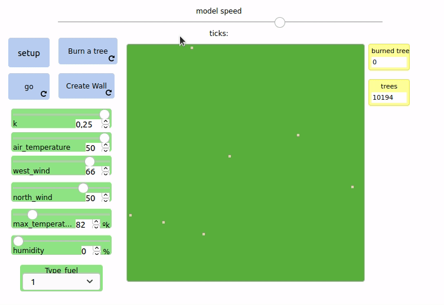
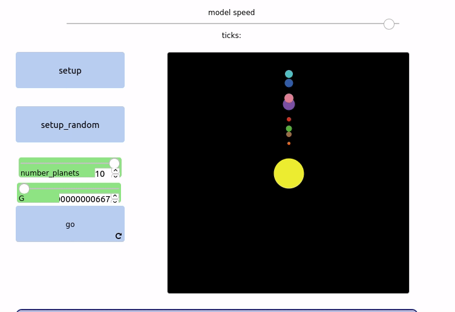
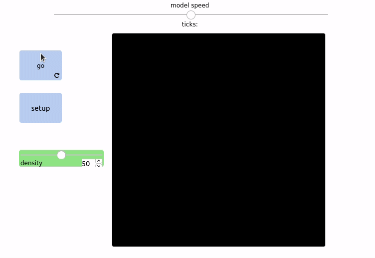

# Multi-agent-simulation

In this repo we can see different examples of applications for multi-agent systems using netlogo

 
   </img>
   
Figure 1: Fire simulator

 
   </img>
   
Figure 2: Planetary systems simulator

 
   </img>
   
Figure 2: Game of life simulator

